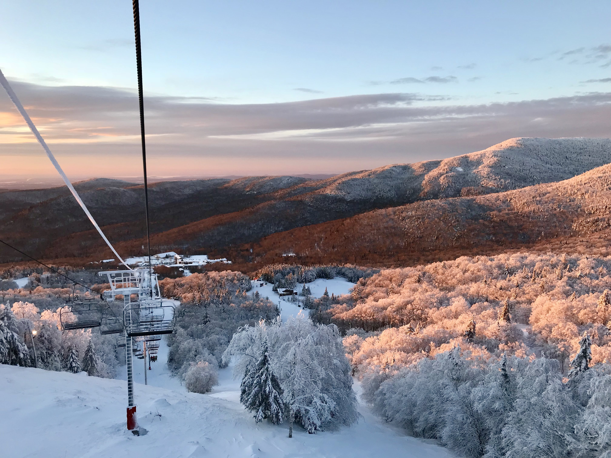
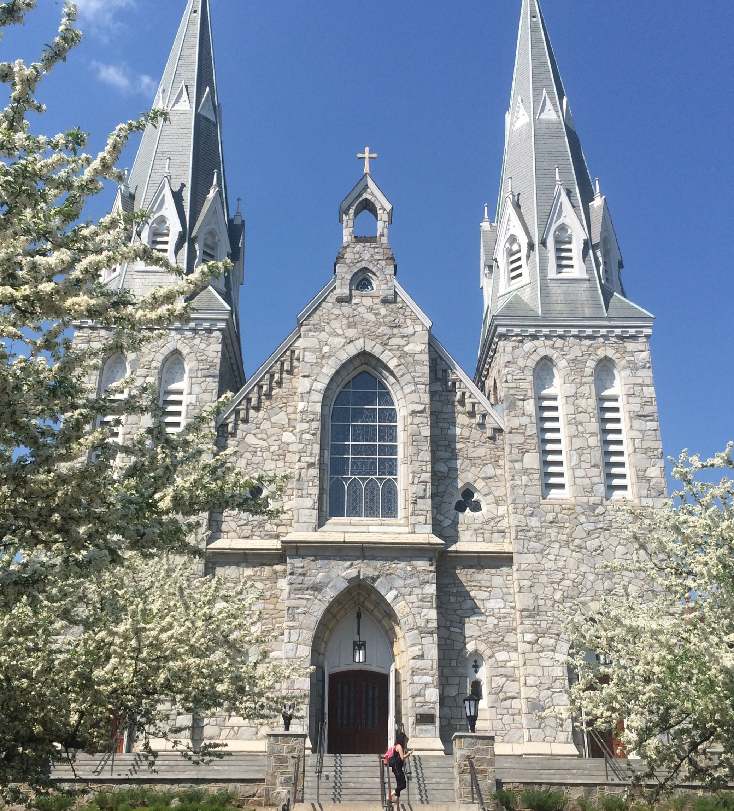
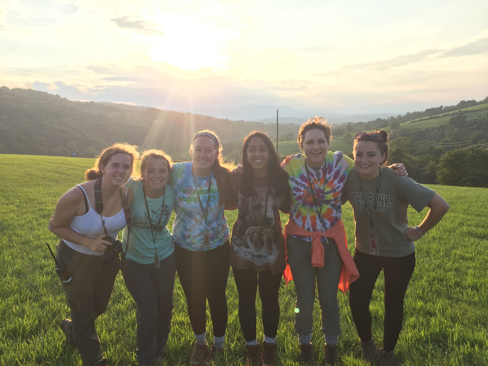
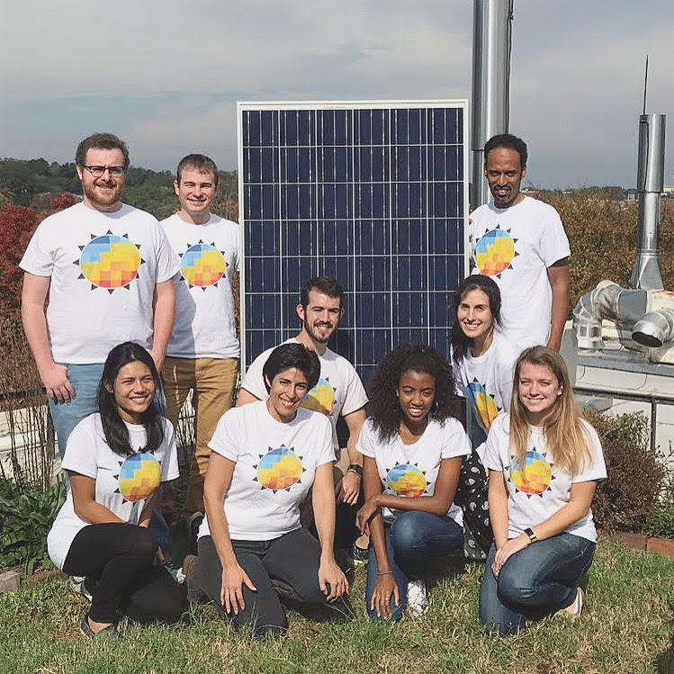
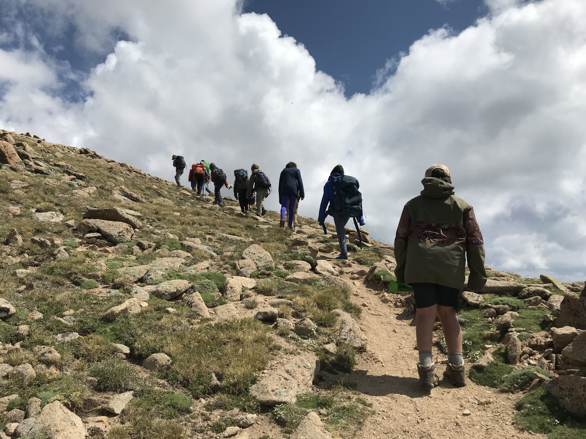
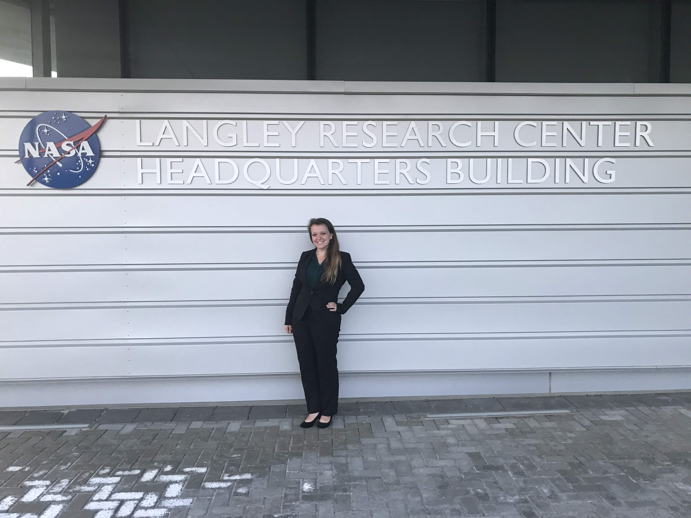
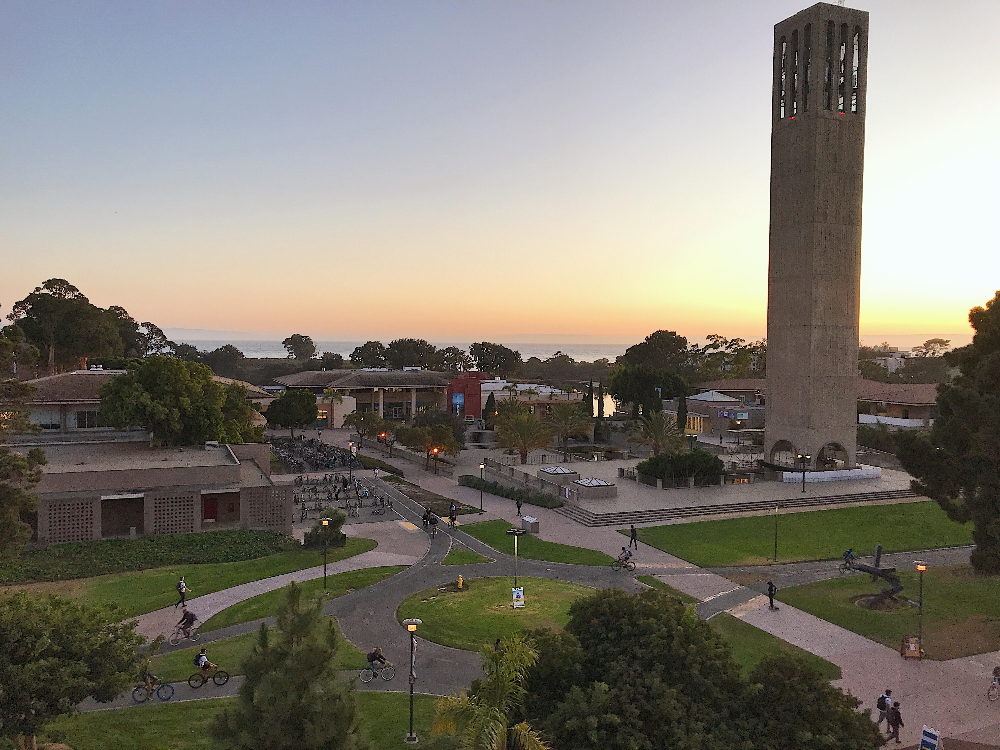

```{r setup, include=FALSE}
knitr::opts_chunk$set(echo = FALSE)

library(tidyverse)
```

I was born in Washington DC but grew up mostly in Vermont where I spent as much time as possible outdoors. My family had always loved camping, hiking, and skiing. In high school I was on the nordic ski team, played field hockey, and ran long distance on the cross-country and track teams.

```{r, out.width='70%', fig.show='hold', fig.align='center'}


# 'vt_btv.jpg', 'vt_xc.JPG', 
```

<center>

 <font size="2"> *Golden Hour at Bolton Valley Ski Resort in Vermont.* </font> 
 
 </center>

In 2017 graduated from Villanova University where I had studied science communication. My undergraduate journey took me from my classes, to teaching in underserved communities in Philadelphia, to writing for local environmental publication [Green Philly](https://www.thegreencities.com/author/marie/), to my study abroad studying sustainable development in Copenhagen, Denmark. This education broadened my world and taught me so much about environmental science and writing, but perhaps more importantly, it taught me about other perspectives, the importance of inclusion, justice, and servant leadership.

```{r, out.width='70%', fig.align='center'}

```
<center>

 <font size="2"> *The iconic Villanova Church.* </font> 
 
 </center>
 
After college, I got to work in outdoor and environmental education. I headed downt o Front Royal, Virginia to work at the [Smithsonian Conservation Biological Institute](https://nationalzoo.si.edu/conservation) (possibly the coolest place in the world) where I developed curriculum, taught high school students, and led hikes in Shenandoah National Park.

```{r, out.width='70%', fig.align='center'}


# , 'va_staff.JPG', 'va_meadow.JPG', 'va_scbi.jpg'
```
<center>

 <font size="2"> *Residential Outdoor Educator team Summer 2017.* </font> 
 
 </center>
 

I then headed continued my journey south down the East Coast to Athens, Georgia where I worked for NASA DEVELOP analyzing and applying NASA Earth Observation data to support resource management decisions. Working at NASA was a dream come true! Check out the [Georgia Energy II](https://develop.larc.nasa.gov/2017/fall/GeorgiaEnergyII.html) and [Osa Peninsula Water Resources] projects (https://develop.larc.nasa.gov/2018/spring/OsaPeninsulaWater.html) that I worked on.

```{r, out.width='70%', fig.align='center'}

```
<center>

 <font size="2"> *Georgia Energy II team Fall 2017.* </font> 
 
 </center>

Then I returned to outdoor education and moved out west to the incredible Summit County Colorado, where I taught and led backpacking trips for kids ages 8 to 17 at the Keystone Science School.

```{r, out.width='70%', fig.align='center'}


# 'co_hike.jpg', 'co_quandary.jpg', 'co_backpack.JPG'
```

<center>

 <font size="2"> *One of my groups hiking Ptarmigan Peak Summer 2018.* </font> 
 
 </center>

It would have been tempting to stay up there in the mountains but then I received an amazing offer to become the next Center Lead of NASA DEVELOP's Georgia node. So I returned to Athens where I managed all the Georgia projects and teams, wrote research proposals for more projects, (including one one on [maple production in Vermont](https://develop.larc.nasa.gov/2019/fall/NorthernForestFoodAgII.html)) got to attend a NASA leadership conference at Langley, and explored the state from the North Georgia Mountains to coastal islands.

```{r, out.width='70%', fig.align='center'}


# 'NASA_globe.jpg', 'langley.jpg', 'savannah.jpg'
```

<center>

 <font size="2"> *Me at the NASA Langley Research Center.* </font> 
 
 </center>

I always knew that I wanted to return to school for my master's degree and so in 2019 I began my grad school journey at the University of California's Bren School of Environmental Science & Management. I have had such wonderful opportunities to learn so many new skills and dive deeper into my interests in spatial analysis, landscape ecology, and science communication. I was able to propose a group project working on research in the Talamanca-Osa region of Costa Rica with the grassroots non-profit Osa Conservation that I had worked with on NASA DEVELOP projects. Check out my Master's project tab to learn more about that research!

```{r, out.width='70%', fig.align='center'}

```
<center>

 <font size="2"> *The view of UCSB campus from my office Fall 2019.* </font> 
 
 </center>