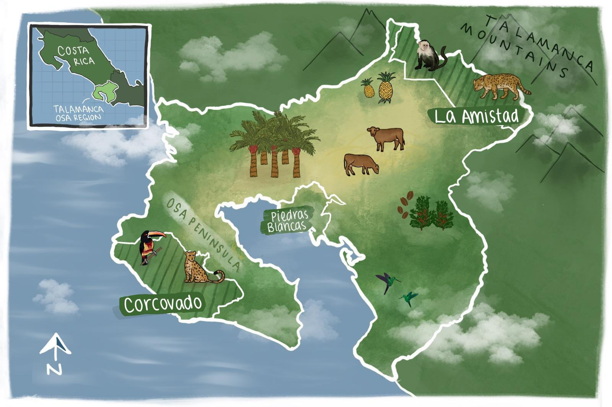
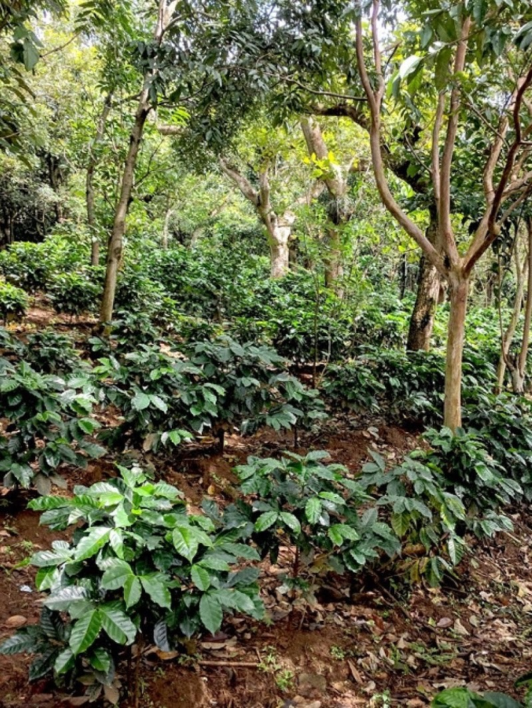

```{r setup, include=FALSE}
knitr::opts_chunk$set(echo = FALSE)

library(tidyverse)

```

## Wildlife-Friendly Farming & Crop Resilience: Economic & Geospatial Analysis of Sustainable Farming in Southern Costa Rica {.tabset}

AmistOsa Ag is working to protect biodiversity in southern Costa Rica by researching how farmers can benefit economically from wildlife-friendly practices. Many wildlife species in the Talamanca-Osa region are threatened by habitat fragmentation from agriculture and by a changing climate. These threats limit their ability to move throughout the region outside of its three protected parks. 



### Project Background

In the Talamanca-Osa region of southern Costa Rica, land development for agriculture, urban areas, and roads has fragmented natural habitats. Ensuring connectivity between these fragmented habitats is important to allow species movement, which can be critical for maintaining viable populations. The ability to move between protected areas allows for increased gene flow and range shifts in response to climate change, both of which are necessary for species’ long-term survival.

<center>

{width=50%}
</center>

The newly established Amistosa Biological Corridor in the Talamanca-Osa region provides an important pathway to maintaining biodiversity. This region is significant because it spans areas of high biodiversity and varying topography, including the Corcovado National Park on the Osa Peninsula and La Amistad International Peace Park in the Talamanca Mountains. Increased connectivity within the Talamanca-Osa region will allow species to shift to higher elevations to accommodate warming temperatures, supporting their survival in the face of climate change. 

The Talamanca-Osa region includes a large amount of agricultural land between the Osa Peninsula and the Talamanca Mountains. Local grassroots organization, Osa Conservation, is dedicated to conserving the area’s unique biodiversity and works with farmers in the area to support wildlife-friendly farming. Techniques such as integrating agroforestry practices allow species to move through farmlands and improve connectivity in the corridor.

<center>

{width=50%}
</center>

This project employs economic and spatial analysis to support Osa Conservation’s work and provide farmers with the necessary information to implement sustainable farming practices in a manner that is beneficial to them and the local wildlife. 

A spatial connectivity analysis identified areas of highest importance for conservation efforts to allow for wildlife movement. Increasing area naturalness with wildlife-friendly farming techniques can be an important strategy in increasing overall connectivity. 

Long-term planning must account for the effects of climate change, so a projected suitability analysis of climate-driven impacts on key local crops was an important part of this project. Farmers can use this information to make informed decisions in their current management practices and future planning. Check out this [shiny app](https://h6g8vs-mgbouff.shinyapps.io/amistosa_shiny_app/?_ga=2.33459062.994883449.1642984851-586161883.1642717600) I created to help Osa Conservation communicate the results of this analysis.

Engaging local farmers is critical in achieving a truly sustainable, functioning corridor, so participation must be economically viable. An economic analysis explored the economic costs and benefits to farmers for attaining eco-certifications that promote wildlife-friendly farming. 

Ultimately, this project helped contribute to Osa Conservation’s aim to conserve Costa Rica’s outstanding biodiversity while enhancing the community’s economic opportunities. 
